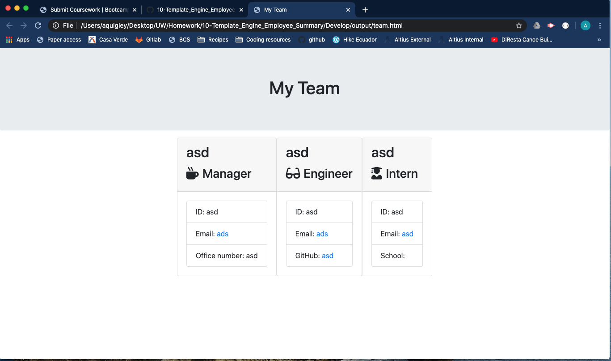
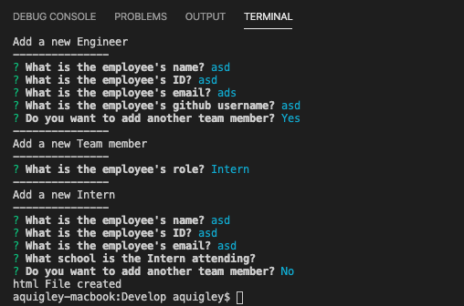

# Unit 10 OOP Homework: Template Engine - Employee Summary

## User Story:

```
As a manager
I want to generate a webpage that displays my team's basic info
so that I have quick access to emails and GitHub profiles
```
## Description:

This project was the second dive into the wonderful world of npm, terminal, javascript and node. In this project I developed (with the help of the class), a software engineering team generator command line application. This was done using the Inquirer npm package to prompt the user for information. It runs as a Node CLI. It then creates a html page displaying the information. there are JEST tests to ensure that the objects are being created correctly.

## Screenshots:

Generated HTML Page:



Command Line Interface:


